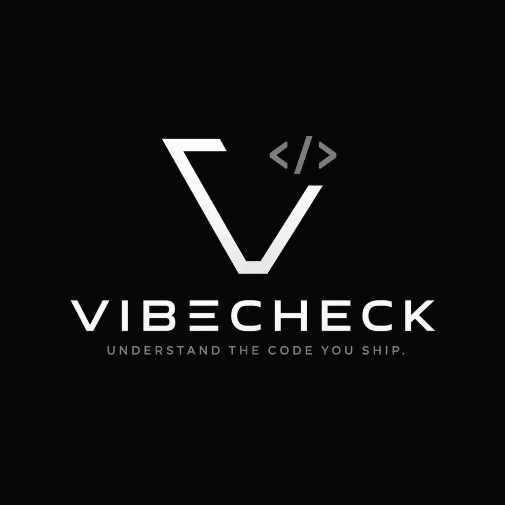

<p align="center">
  
</p>

<h2 align="center">"VibeCheck: The Virtual Senior Developer in Your Terminal"</h2>

<p align="center">
  <a href="https://pypi.org/project/vibecheck-ai-tool/"></a>
  <a href="https://pypi.org/project/vibecheck-ai-tool/"></a>
  <a href="https://github.com/apiprdt/vibecheck/blob/main/LICENSE"></a>
</p>

<p align="center">
  <a href="https://github.com/apiprdt/vibecheck"></a>
  <a href="https://github.com/apiprdt/vibecheck"></a>
  <a href="https://x.com/AfifErditaa"></a>
  <a href="https://instagram.com/afiferdita"></a>
</p>

---

### **Understand the code your AI wrote.**

AI tools make you faster. **VibeCheck** makes sure you actually understand what you're shipping. It acts as an interactive tutor and a strict code auditor directly in your terminal, tracking what you've learned so you depend less on AI over time.

---

## ✨ Why VibeCheck?

VibeCheck isn't just another linter. It's a bridge between "AI-generated code" and "Senior-level understanding."

### 🧠 **1. Golden Rules (Project Context)**
Most AI auditors give generic advice. VibeCheck reads your local `.vibecheck_rules.md` to enforce project-specific standards. 
*Example: "In this project, we never use `print()`, we always use `logging`."*

### ⚡ **2. Smart Caching**
Built for efficiency. VibeCheck caches AI responses locally (`~/.vibecheck/cache`). If you scan the same file twice, the result is instant and costs **zero** API tokens.

### 🎓 **3. Absolute Beginner Mode (`--learn`)**
Don't know what a "Race Condition" or "SQL Injection" is? VibeCheck explains complex security flaws using simple real-world analogies (like a restaurant or a locked door).

### 💬 **4. Interactive REPL Mode (`--chat`)**
Confusion? Just ask. Start an interactive session directly in your terminal to discuss specific lines of code with VibeCheck.

---

## 📸 Showcase

<table align="center">
  <tr>
    <td align="center"><b>Security Audit</b></td>
    <td align="center"><b>Beginner Explanations</b></td>
  </tr>
  <tr>
    <td></td>
    <td></td>
  </tr>
  <tr>
    <td align="center"><i>Catches critical flaws instantly.</i></td>
    <td align="center"><i>ELI5 analogies for technical concepts.</i></td>
  </tr>
</table>

---

## 🚀 Quick Start

### Installation
```bash
pip install vibecheck-ai-tool
```

### Setup API Key
```bash
# Set your preferred provider
export OPENAI_API_KEY="sk-..."
# OR
export ANTHROPIC_API_KEY="sk-..."
```

### Basic Usage
```bash
# Scan a file
vibecheck file.py

# Scan only files staged in Git (Senior Workflow)
vibecheck --staged

# Learn mode (for beginners)
vibecheck file.py --learn

# Interactive chat mode
vibecheck file.py --chat
```

---

## 👨‍💻 About the Author
Built with ❤️ by a **16-year-old developer** who believes that AI should make us better developers, not just faster ones. Created in 24 hours to help everyone "Vibe Code" with confidence.

---

## 📄 License
MIT License. Feel free to contribute!
