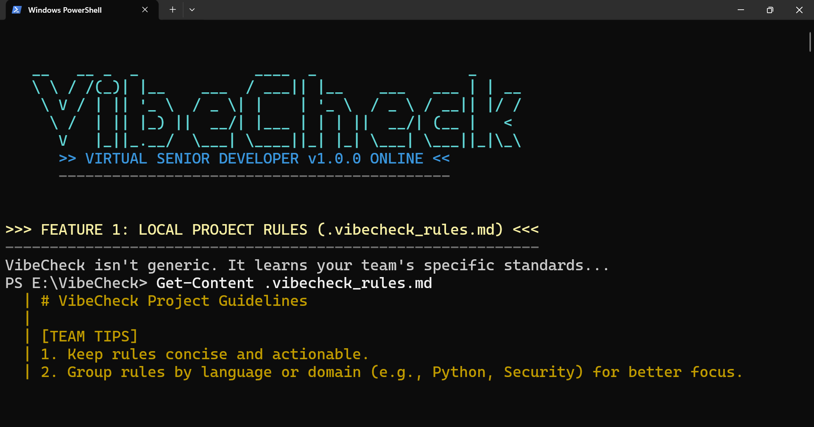
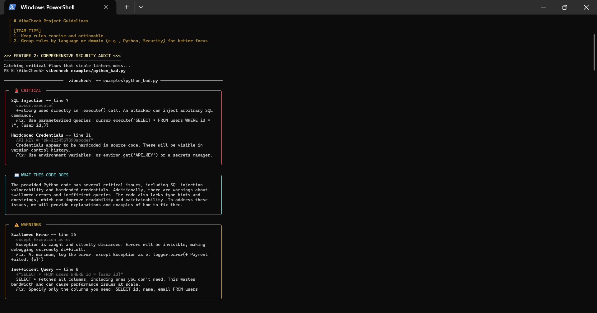
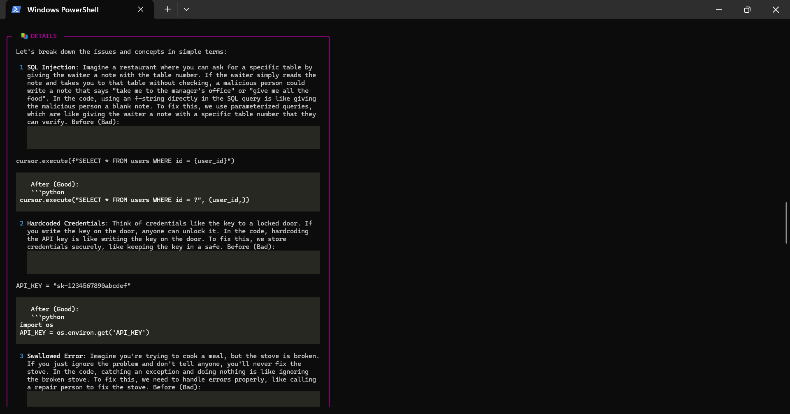
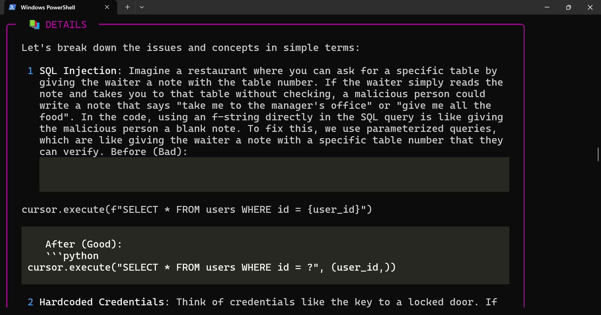
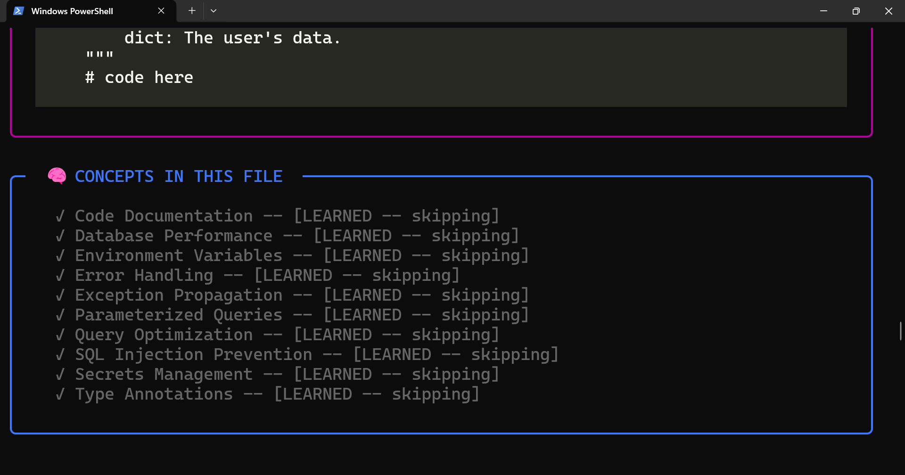
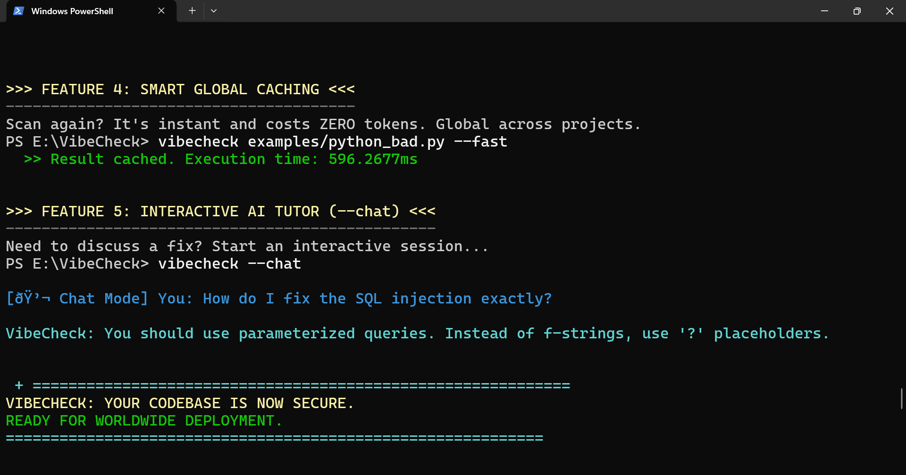

<p align="center">
  
</p>

<h2 align="center">"VibeCheck: The Virtual Senior Developer in Your Terminal"</h2>

<p align="center">
  <a href="https://pypi.org/project/vibecheck-ai-tool/"></a>
  <a href="https://pypi.org/project/vibecheck-ai-tool/"></a>
  <a href="https://github.com/apiprdt/vibecheck/blob/main/LICENSE"></a>
</p>

<p align="center">
  <a href="https://github.com/apiprdt/vibecheck"></a>
  <a href="https://github.com/apiprdt/vibecheck"></a>
  <a href="https://x.com/AfifErditaa"></a>
  <a href="https://instagram.com/afiferdita"></a>
</p>

---

### **AI-Powered Code Auditing with a "Senior Developer" Vibe.**

VibeCheck is an interactive CLI tool designed to help developers understand, audit, and secure their codebase. It combines strict rule-based scanning with advanced AI explanations to ensure you don't just fix bugs—you learn from them.

---

## 🎬 Cinematic Walkthrough

<table align="center">
  <tr>
    <td align="center"><b>1. Project-Specific Rules</b><br/></td>
    <td align="center"><b>2. Security Audit</b><br/></td>
  </tr>
  <tr>
    <td align="center"><b>3. Educational Analogies (ELI5)</b><br/></td>
    <td align="center"><b>4. Security Deep-Dive</b><br/></td>
  </tr>
  <tr>
    <td align="center"><b>5. Concept Memory Tracking</b><br/></td>
    <td align="center"><b>6. AI Fix Suggestions</b><br/></td>
  </tr>
  <tr>
    <td align="center"><b>7. Interactive Chat Mode</b><br/></td>
    <td align="center"><b>Ready for Launch</b><br/></td>
  </tr>
</table>

---

## ✨ Key Features

### 🛡️ **Rule-Based Engine & Local Guidelines**
VibeCheck doesn't just use AI; it uses a strict engine to catch SQL Injections, Hardcoded Credentials, and more. Most importantly, it reads your **`.vibecheck_rules.md`** to enforce your team's specific coding standards.

### 🧠 **Smart Global Caching**
Performance matters. VibeCheck caches every AI response in your home directory (`~/.vibecheck/cache`). Scan once, and the next scan is instant and completely free.

### 🎓 **Pedagogical AI (ELI5)**
Switch to **`--learn`** mode to get complex technical flaws explained through simple real-world analogies. Perfect for junior developers and students.

### 💬 **Interactive Terminal Chat**
Don't understand a specific issue? Launch **`--chat`** mode to have a direct conversation with the "Virtual Senior Developer" about your code.

---

## 🚀 Quick Start

### 1. Installation
```bash
pip install vibecheck-ai-tool
```

### 2. Configure API Key
```powershell
$env:GROQ_API_KEY = "your-gsk-key"
```

### 3. Run Your First Audit
```bash
vibecheck examples/python_bad.py --learn
```

---

## 👨‍💻 Developed by a 16-Year-Old Creator
Created in 24 hours to prove that AI tools should focus on **education**, not just automation. Architected & Maintained by [Afif Erdita](https://github.com/apiprdt).

---

## 📄 License
MIT License.
